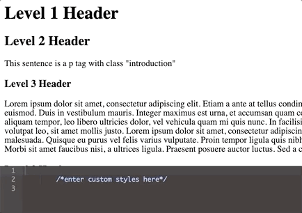

# In-Site CSS Editor

This project was a challenge for a MintBean Hackathon- simple, but lots of fun in just a few hours!

The task was to make a live CSS editor, so a user could see changes to styles as they typed.

I had some difficulty figuring out how to use the Ace editor, but got it working in the end.

Next time, I would make my own editor with html/css/javascript, or at least use a .gitignore and save the instructions for how I downloaded Ace from the Ajax github, so anyone who wanted to run this project on their own computer wouldn't have to download the whole Ace package with this repo.

